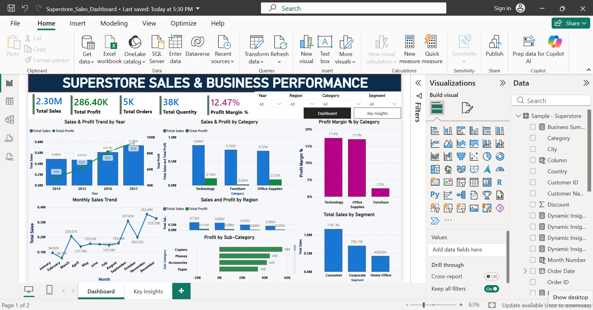
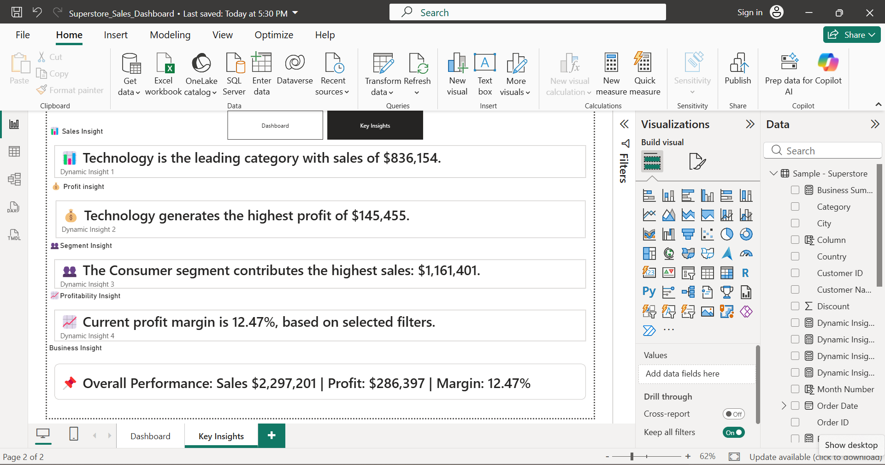

# 📊 Superstore Sales & Business Performance Analysis

An end-to-end data analytics project using **Python, SQL, and Power BI** to analyze sales, profitability, customer segments, categories, regions, and business performance using the Superstore dataset.

---

## 📌 Project Overview

This project focuses on analyzing the Superstore dataset to identify important sales and profitability patterns and present the findings through an interactive Power BI dashboard.

The project follows an end-to-end analytics workflow:

**Data → Python → SQL → Power BI → Business Insights**

---

## 🎯 Business Objectives

- Analyze overall sales and profit performance
- Identify high-performing product categories
- Analyze sales and profitability by region
- Understand customer segment performance
- Analyze sales trends over time
- Calculate important business KPIs
- Identify meaningful business insights
- Build an interactive Power BI dashboard

---

## 🛠️ Tools & Technologies

- **Python**
  - Pandas
  - NumPy
  - Matplotlib
  - Seaborn

- **SQL**
  - Aggregation
  - GROUP BY
  - Filtering
  - CASE statements
  - Business analysis queries

- **Power BI**
  - Interactive dashboards
  - DAX
  - KPI cards
  - Slicers
  - Dynamic insights
  - Page navigation

---

## 📂 Dataset

The project uses the **Superstore dataset**, containing information related to:

- Orders
- Customers
- Products
- Categories
- Sub-Categories
- Sales
- Profit
- Quantity
- Regions
- Segments
- Shipping
- Order dates

---

## 🐍 Python Analysis

Python was used for data cleaning, exploration, and exploratory data analysis.

Main analysis includes:

- Dataset inspection
- Missing-value analysis
- Data type checking
- Sales analysis
- Profit analysis
- Category analysis
- Regional analysis
- Segment analysis
- Time-based analysis
- Data visualization

Notebook:

`Python/Superstore_Sales_Analysis.ipynb`

---

## 🗄️ SQL Analysis

SQL was used to perform structured business analysis and validate important metrics.

Key analysis includes:

- Total Sales
- Total Profit
- Total Orders
- Total Quantity
- Profit Margin
- Sales by Category
- Profit by Category
- Sales by Region
- Sales by Segment
- Product-level analysis

SQL file:

`SQL/Superstore_Analysis.sql`

---

## 📊 Power BI Dashboard

The Power BI report contains two main pages:

### 1. Dashboard

The dashboard provides an overview of:

- Total Sales
- Total Profit
- Total Orders
- Total Quantity
- Profit Margin
- Sales trends
- Category performance
- Regional performance
- Segment performance
- Sub-category performance

### 2. Key Insights

The Key Insights page provides dynamic business insights based on the selected filters.

It includes:

- Sales Insight
- Profit Insight
- Segment Insight
- Profitability Insight
- Overall Performance Summary

The report also uses synchronized slicers and page navigation for interactive analysis.

---

## 💡 Key Findings

Based on the analysis:

- **Technology** is the leading category by sales.
- **Technology** generates the highest category-level profit.
- **Consumer** is the leading customer segment by sales.
- Overall sales are approximately **$2.30M**.
- Overall profit is approximately **$286.40K**.
- Overall profit margin is approximately **12.47%**.

> These findings are based on the selected Superstore dataset and overall report context.

---

## 📸 Dashboard Preview

### Dashboard



### Key Insights



---

## 📁 Project Structure

```text
Project-2-Superstore-Sales-Analysis/
│
├── Dataset/
│   └── Sample-Superstore.csv
│
├── Python/
│   └── Superstore_Sales_Analysis.ipynb
│
├── SQL/
│   └── Superstore_Analysis.sql
│
├── PowerBI/
│   └── Superstore_Sales_Dashboard.pbix
│
├── Images/
│   ├── dashboard-overview.png
│   └── key-insights.png
│
└── README.md


🐍 Python Analysis
Python was used for data cleaning, exploratory data analysis, visualization, and business analysis.
Main analysis includes:
- Data inspection
- Data cleaning
- Sales analysis
- Profit analysis
- Category analysis
- Regional analysis
- Segment analysis
- Time-based analysis
🗄️ SQL Analysis
SQL was used for structured business analysis and validation.
Analysis includes:
- Total Sales
- Total Profit
- Total Orders
- Total Quantity
- Profit Margin
- Sales by Category
- Profit by Category
- Sales by Region
- Sales by Segment
- Product-level analysis
📊 Power BI Dashboard
The Power BI report contains two pages:
Dashboard
Includes:
- Total Sales
- Total Profit
- Total Orders
- Total Quantity
- Profit Margin
- Sales trends
- Category performance
- Regional performance
- Segment performance
- Sub-category performance
Key Insights
Includes dynamic insights based on selected filters:
- Sales Insight
- Profit Insight
- Segment Insight
- Profitability Insight
- Overall Performance
💡 Key Findings
- Technology is the leading category by sales.
- Technology generates the highest category-level profit.
- Consumer is the leading customer segment by sales.
- Total Sales: approximately $2.30M
- Total Profit: approximately $286.40K
- Profit Margin: approximately 12.47%
📸 Dashboard Preview
Dashboard
 
Key Insights
 
🚀 How to Use

       Python
             Open:
                  Python/Superstore_Sales_Analysis.ipynb

   Run the notebook using Jupyter Notebook, JupyterLab, or VS Code.
       SQL
             Open:
                  SQL/Superstore_Analysis.sql
   Run the queries in a compatible SQL environment.
       Power BI
             Open:
                  PowerBI/Superstore_Sales_Dashboard.pbix
   Use the slicers and navigation buttons to explore the dashboard.


📌 Project Highlights

         This project demonstrates an end-to-end data analytics workflow combining:

         Python + SQL + Power BI + DAX + Business Intelligence

👨‍💻 Author
    Harsh
    M.Sc. Data Science & Machine Learning